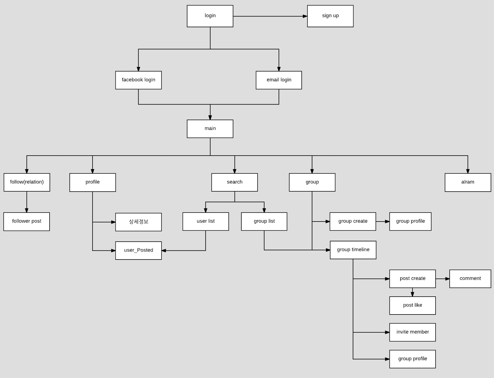
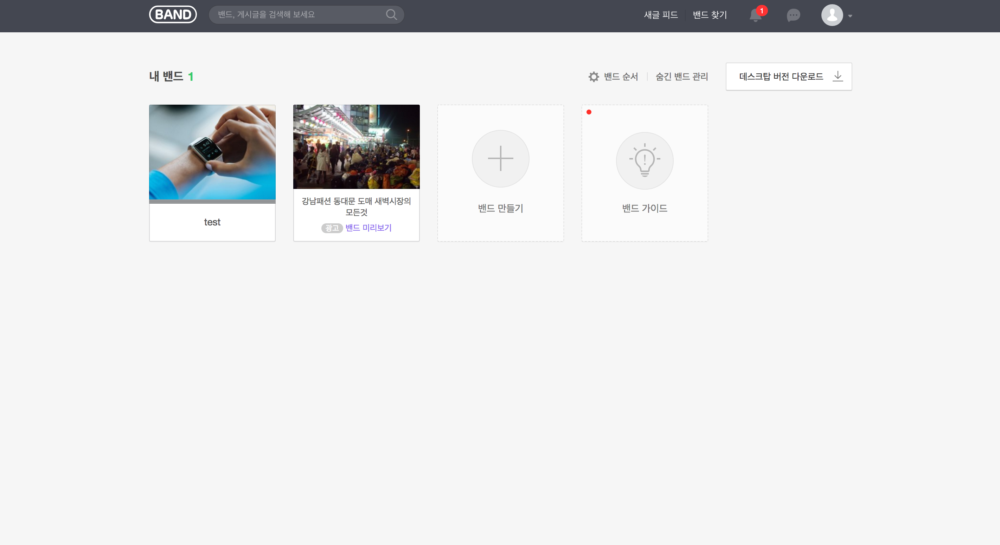
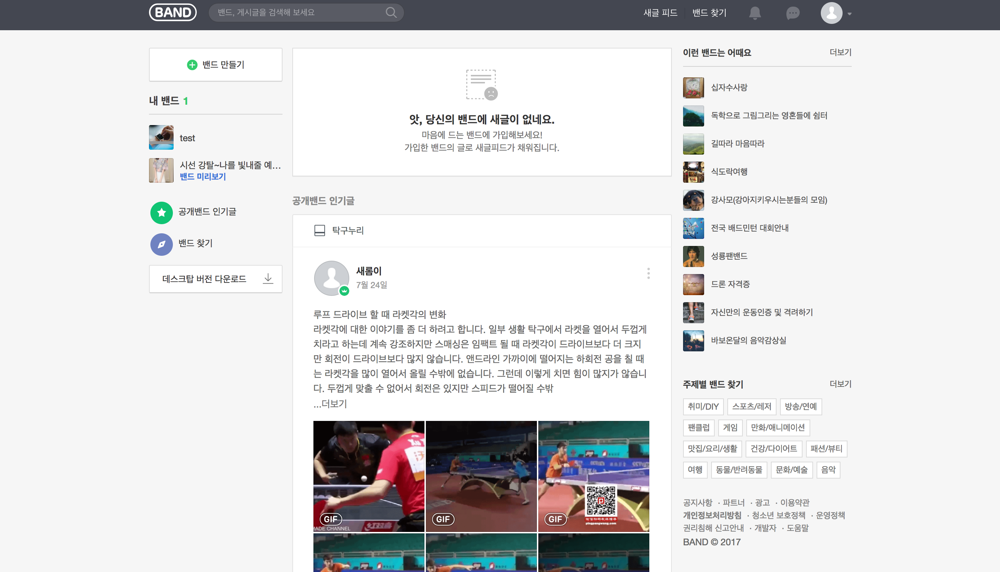

# 8조

김기홍, 김영민, 이다함

---

## 목차

1. 프로젝트
2. 핵심기능
3. 스프린트
4. [QnA](#qna)

---

## 1. 프로젝트

### 목표 
- SNS 를 만들어보자!!!!

### SNS이란? 
```
Sㅣ간 Nㅏ비 Sㅓ비스  
     ㅇ
```

#### Band(밴치마킹)

그룹(관심분야) 기반 사회관계망 서비스




---



## 2. 핵심기능


[bond](https://ovenapp.io/view/sfEcSX90YQp3qGrArrId2gOs3WelCKad/Uewio)


### 유저(abstractbaseuser)
- 회원가입
- 로그인(email, facebook) / 로그아웃
- follower/following

### 그룹
- 그룹 태그 검색
- 그룹 관리자 권한
- 그룹 타임라인
- 그룹 숨기기

### 포스팅
- 사진
- 비디오(youtube url)
- 파일 첨부
 

## 3. 스프린트

### 1주차 : 서버구축 (Complete!)
- 거시적 모델링, AWS

### 2주차 : 백엔드 구축 (Working)
- 세부 모델링, API, API 문서화

### 3주차 : 백엔드 구축
- 필요시 추가기능 구현(email 인증, 친구맺기)

### 4주차 : 백엔드 안정화 


## QnA

1. 비밀번호 변경(ori_password)
2. method 에 대해 api 가능한가요?
3. 
4. 